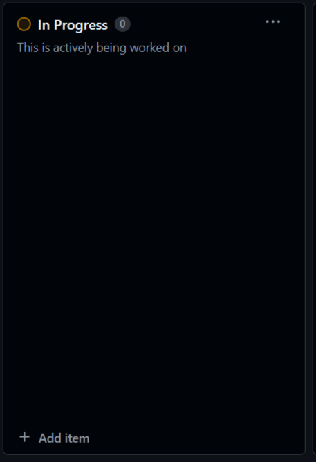
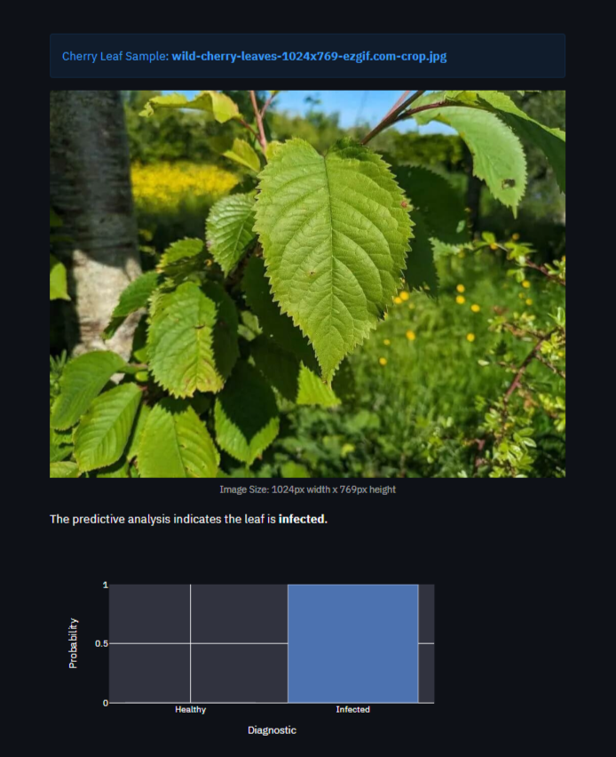

# Detection of powdery mildew on cherry leaves

Powdery mildew is a common fungal infection that affects cherry trees, often causing a web of white fibres covering the leaves. This infection can lead to premature leaf drop, reduced photosynthesis, and weakened trees. Over time, affected cherry trees may exhibit stunted growth, decreased fruit production, and lower fruit quality. In severe cases, the overall health and longevity of the tree can be compromised, making it more susceptible to other diseases and environmental stresses. As such it is crucial to monitor cherry orchards for powdery mildew infection, this is where this project enters.

***

**[Link to live Streamlit app](https://cherryleafinfect-4f02b3a49366.herokuapp.com)**

This is the Milestone Project for Predictive Analytics section of the Full Stack Developer Course taught through Code Institute
***

## Dataset Content

* The dataset for this project is sourced from **[Kaggle](https://www.kaggle.com/codeinstitute/cherry-leaves)**.
* The dataset contains over 4,000 images of both infected and healthy cherry leaves, all taken with the client's permission from trees within their cherry orchards. Although the company has a varied portfolio, cherries remain one of their most important crops. Consequently, they are seriously concerned about the potential impact of supplying sub-standard products.
* Due to size constraints for deploying to Heroku I have been forced to resize the images.  Originally the images were all *256 x 256*, after some testing I have resized them to *175 x 175*, this size minimises loss of quality while just scrapping under the Heroku size limit.

## Business Requirements

*For clarrity this is an eductaion based assignment, as such the company used here is for illustration purposes.*

Farmy & Foods' cherry orchard is facing a crisis as workers have noticed typical signs of powdery mildew on some trees. Currently, staff manually verify the presence of powdery mildew, spending approximately 30 minutes collecting and visually inspecting leaves. If powdery mildew is detected, fungicide is applied. With thousands of cherry trees spread across multiple locations nationwide, this process is not scalable, limiting its effectiveness.

We have been approached to find a scalable, quick, and easy solution that remains cost-effective. During a brainstorming session, the IT team suggested a machine learning approach. This solution would enable rapid detection and be simple to use in the field, utilising images of tree leaves. Farmy & Foods already monitors other crops using similar manual processes. If this initiative is successful, it could well be implemented for other crops.

The data used for this project is a collection of cherry leaf images provided by Farmy & Foods, taken from their orchards.

## Hypothesis and how to validate?

* That infected cherry leaves will have clear visual signs of infection across the surface of a leaf, that will differentiate them from healthy leaves.

  * Validation - The model successfully detected the differences between infected and healthy leaves, learning to differentiate and generalise to make accurate predictions. A good model trains its ability to predict classes on a batch of data without adhering too closely to that specific set. This way, the model generalises and reliably predicts future observations because it didn't merely 'memorise' the relationships between features and labels seen in the training dataset but learned the general patterns from features to labels.

* An Image Montage shows that typically an infected leaf is covered in a web of white fibers. Average Image, Variability Image and Difference between Averages studies did not reveal any clear pattern to differentiate one from another.

  * Validation - The analysis of the Image Montage confirmed that the visual differences between infected and healthy leaves were subtle and not easily distinguishable using average and variability images alone. Despite this, the model demonstrated a perfect F1 score of 1.0, indicating that it successfully learned to identify the specific features distinguishing infected from healthy leaves, even when these features were not apparent in simple image comparisons. This indicates that the model was not misled by the visual complexity of the infected leaves but instead captured the underlying patterns necessary for accurate classification.

## The rationale to map the business requirements to the Data Visualisations and ML tasks

* The client is interested in conducting a study to visually differentiate a healthy cherry leaf from one infected with powdery mildew.
  * Using streamlit to create a dashboard that is easy to navigate and intuitive, utilising an interactive sidebar:
    * Contains a page "Cherry Leaf Visualaiser" that displays different diagonistic images depending on checkbox.
    * An "average" and "variabiltiy" side by side for both healthy and infected leaves, these are similar to the `mean` and `standard deviation` if this was numerical instead of visual.
    * A side by side of the averages of both healthy and infected images with the difference between them.
    * A montage of random images based on the label for quick visual reference.

* The client is interested in predicting if a cherry leaf is healthy or contains powdery mildew.
  * Using streamlit to create a dashboard that is easy to navigate and intuitive, utilising an interactive sidebar:
    * Contains a page "Powdery Mildew Detector" that allows you to upload your own images to be tested.
    * It will reject images that are too big or the wrong format, currently included formats in this app;
      * jpg, jpeg, and png.
    * It will output the image and a report that can be downloaded or screen captured with the information.

## Machine Learning Business Case

* We aim to develop a machine learning model to predict whether a leaf is infected with powdery mildew using an image database provided by the client. This problem falls under supervised learning and involves building a binary (two-class), single-label, classification model.
* Our ideal outcome is to provide the clients a more reliable, faster, and cost effective product for powdery mildew detection.
* The model success metrics are:
  * Accuracy of 97% or above on the test set.
* The model will indicate if a leaf has powdery mildew and provide the probability of infection. Staff can take pictures of leaves and upload them directly to the app, the images will then be analysed and a prediction report created that can be acted upon immediately.

* The current detection method relies on manual inspection. Currently staff spend around 30 minutes per tree, taking a number of samples and visually checking if they are healthy or infected. The current method is slow and prone to inaccuracies due to human error.
* The training data used for the model came from the leaves database provided by client and uploaded on Kaggle. This dataset contains 4208 images of cherry leaves, split evenly between healthy and infected.

## Dashboard Design - Streamlit app

### Page 1 - Project Summary

* Contains several sections covering a quick overview of the apps purpose:
  * **General Information** very brief overview of the reasoning behond this project.
  * **Project Dataset** description of the dataset as sourced from kaggle.
* A link to the Readme

### Page 2 - Cherry Leaf Visualiser

* Contains several sections covering the visualiser page:
  * Two small paragraphs with page information.
  * A link to the Readme
  * Three checkbox options that display different information:
    * Including the following overview images

* Differences between the datasets

* An image montage compiler of either healthy or infected leaves depending on the selection.

### Page 3 - Cherry Leaf Mildew Detector

* The simplest page with respect to content:
  * A sentence relavent to the page.
  * A link to the dataset that can be downloaded for testing
  * A link to the Readme
  * A widget for uploading images:
    * It explains size restrictions
    * Suitable image formats
    * And a browse button
* This is a sample of the output from the detector:

You can see at the bottom of the image a download link, this will download a CSV file that can be viewed in spreadsheet program like [Google Sheets](https://docs.google.com/spreadsheets/u/0/).

### Page 4 - Project Hypothesis

* Sections for each hypothesis including a statement, explanation, and conclusion.
* A link to the Readme.

### Page 5 - Machine Learning Performance

* This page is the page of nuts and bolts, I have done my best to keep it layman friendly it includes an overview of the data and an overview of the machine learning output.
  * The first section is about the dataset breakdown:
    * Initially I had included a bar chart of the distribution of data by set and label, however I changed this because I felt piecharts would represent the data better. The piecharts are generally easier to read.
  * The remainder of the page is about the model and ML:
    * These infographics are exactly as I intended from the outset.
      * Model performance  - Classification report
      * Model accuracy - Confusion matrix
      * Model History - Accuracy and Losses
      * Model evaluation result on Test set

## The process of Cross-industry standard process for data mining - CRISP-DM

CRISP-DM (Cross-Industry Standard Process for Data Mining) is a widely used methodology that provides a structured approach to planning and executing data mining projects, consisting of six phases: business understanding, data understanding, data preparation, modeling, evaluation, and deployment. It helps ensure that data mining projects are systematic and results are reliable, making it adaptable to various industries and applications.

**Further reading**: [Data Science Process Alliance - What is CRISP-DM](https://www.datascience-pm.com/crisp-dm-2/)

A kanban board is an agile project management tool designed to help visualise work, limit work-in-progress, and maximise efficiency. It can help both agile and DevOps teams establish order in their daily work. Kanban boards use cards, columns, and continuous improvement to help technology and service teams commit to the right amount of work, and get it done!

Kanban Board for current project.

### Examples cards from the kanban board

|  |  |
|:-------------------------------------------:|:-------------------------------------------:|
| Epics from the kanban                                    | Todo cards                                    |
|  |  |
| In progress cards                                   | Completed cards                                    |

In these images you can see the flow of work across the board.
*There are user stories still in the 'Todo' section because these are beyond the scope of this project, but in the real world they would be part of the continuing build process.*

## Bugs and Testing

### Fixed Bugs

* No significant issues were encountered while doing this project, I have used Chat GPT to check my spelling and grammar.  I did encounter a few syntax errors but nothing serious or unfixable.

### Unfixed Bugs

* The image below shows a false prediction result

* **Issue:** The above image, despite looking healthy was predicted infected.
* **Potential Causes:**
  * The sun shining on the image has increased the saturation of pixels, resulting in greater amounts of light/white pixels being wrongly interpreted as powdery mildew infection.
  * The background and foreground have very little contrast; as a result, the model could have struggled to differentiate the leaf shape correctly.
* **Potential Fix:** The model needs further tuning on a more diverse set of data.

### Testing

In order to test the detector page I found several images on the internet and ran them through the detector widget.  The images I tested are displayed below, one is missing it the one that didn't return a 100% healthy response.

|  |  |
|:-------------------------------------------:|:-------------------------------------------:|
| Healthy leaf correctly identified                                    | Healthy leaf incorrectly identified                                    |
|  |  |
| Infected leaf correctly identified                                   | Infected leaf correctly identified                                    |

## Deployment - Using Github and Heroku

### Cloning the Repository

* On Github navigate to the repository "<https://github.com/Swewi/milestone-project-mildew-detection-in-cherry-leaves/tree/main>"
* Click "Code" drop down menu - a green button shown right above the file list.
* Copy the URL of the repository using "HTTPS", "SSH" or "Github CLI".
* Open Git Bash.
* Change the current working directory to the location where you want the cloned directory.
* Type "git clone", and then paste the URL copied earlier.
* Press enter to create local clone. A clone of the repository will now be created.

* For more details on how to clone the repository in order to create a copy for own use refer to the site:
[Cloning a Repository](https://docs.github.com/en/repositories/creating-and-managing-repositories/cloning-a-repository)

### Forking a Repository

* On Github navigate to the repository "<https://github.com/Swewi/milestone-project-mildew-detection-in-cherry-leaves/tree/main>"
* Click "Fork" located towards top right corner on GitHub page.
* Select "owner" for the forked repository from the dropdown menu under "owner".
* It will create forked repo under the same name as original by default. But you can type a name in "Repository name" or add a description in "Description" box.
* Click on "Create fork". A forked repo is created.

#### Important Information about forking a repository

* Forking allows you to make any changes without affecting original project. You can send the the suggestions by submitting a pull request. Then the Project Owner can review the pull request before accepting the suggestions and merging them.
* When you have fork to a repository, you don't have access to files locally on your device, for getting access you will need to clone the forked repository.
* For more details on how to fork the repo, in order to for example suggest any changes to the project you can:
[Forking a Repository](https://docs.github.com/en/get-started/quickstart/fork-a-repo)

### Deploying the app - Heroku

* Set the runtime.txt Python version to a [Heroku-20](https://devcenter.heroku.com/articles/python-support#supported-runtimes) stack currently supported version.

* **Important information for running an older version of python:**

  * If an error occurs when deploying stating that the Python version is not available, it is probably due to the stack used for the application. To fix this, log in to the Heroku command line interface (CLI) and use the following command to set the stack to Heroku-20.

    * heroku stack:set heroku-20 -a your-app-name
      * In this case the your-app-name is **cherryleafinfect**

* The app is deployed from Heroku using the following steps:
  * Create Heroku account.
  * In the top right, click 'New'.
  * Click 'Create new app'.
  * Give your app a name and select your region from drop down.
  * Click 'Create new app'.
  * Select 'Deploy' tab at the top.
  * Select 'Github' from 'Deployment method'.
  * Type the name given to your project in Github and click 'search'.
  * Scroll down and select Manual deployment method.
  * You can also use Auto deployment method to allow the project to update every time you push the code.
  * You can now click to view the app ready and running.
  * If the slug size is too large, then add large files not required for the app to run to the .slugignore file.

#### Important Information about forking a repository - Heorku

* The web application is displayed and deployed using template provided by Code Institute to test the code.
* For this project I used Manual deployment method to deploy the current state of the branch, every time I pushed the code from Gitpod.

* The App live link: [Link to live Streamlit app](https://cherryleafinfect-4f02b3a49366.herokuapp.com)

## Technologies Used

### Languages

* Python - The primary programming language used for data processing and machine learning tasks.
* Markdown - Creating the readme and adding information to the Jupyter notebooks.

### Platforms

* Jupyter Notebooks - For development, experimentation, and visualization of code and results, inside Gitpod.
* Gitpod - IDE to develop the website.
* Github - To host the source code and a link to the live site.
* Heroku - To deploy the live site.

### Resources

* Git to provide version control (to commit and push code to the repository).
* Tinyjpg - Tidy up images for readme and testing.
* Kaggle - Dataset hosting site, including the dataset used for this project.
* Ezgif - Converting images for testing to jpg.
* TinyURL - tinyifing URL's for Readme.
* Code Institute Repo - [Blank repo for cherry leaf project](https://github.com/Code-Institute-Solutions/milestone-project-mildew-detection-in-cherry-leaves)

### Libraries

* Streamlit - For creating the interactive and user-friendly dashboard.
* Pandas - For creating and saving dataframes.
* Numpy - For converting to arrays.
* Matplotlib - For plotting dataset distribution.
* Seaborn - For creating confusion matrix.
* Scikit-learn - For model evaluation.
* TensorFlow - For building and training the model.
* Keras - For creating the model hyperparamters
* PIL (Python Imaging Library) - For handling image files.
* Joblib (Python Library) - For handling .pkl files.

## Credits and Acknowledgements

* **Code Institute** - For supplying the learning environment that has lead me to this point.
  * Also for the walkthrough project - Malaria Detector

### Content

* A list of various sites I referred to for information about Powdery Mildew, in no particular order:
  * "<https://plantwiseplusknowledgebank.org/doi/full/10.1079/pwkb.species.42639>"
  * "<https://www.canr.msu.edu/ipm/diseases/powdery_mildew_of_cherry?language_id=>"
  * "<https://www.wildfooduk.com/wild-plants/wild-cherry/>"
  * "<https://attra.ncat.org/publication/cherry-diseases/>"
  * "<https://extension.usu.edu/planthealth/ipm/notes_ag/fruit-powdery-mildew>"
  * "<https://tinyurl.com/264vvz9c>"

### Media

* The images used for testing visualiser were taken from these sites:
  * [Wild food UK](https://www.wildfooduk.com/wild-plants/wild-cherry/)
  * [WSU Tree Fruit](https://tinyurl.com/264vvz9c)
  * [Tree guide UK](https://www.treeguideuk.co.uk/wild-cherry-tree-identification/)
  * [Lawn Starter](https://www.lawnstarter.com/blog/tree-care/cherry-tree-diseases-how-treat/)

## Acknowledgements

* My Grandmother who passed suddenly not long before I started this portion of the course
  * Edna Bellamy 1927 - 2024, Matamata, New Zealand
* My partner for dealing with freak outs and frustration
* Both of my mentors:
  * Ronan - projects 1 to 4
  * Rohit - project 5
